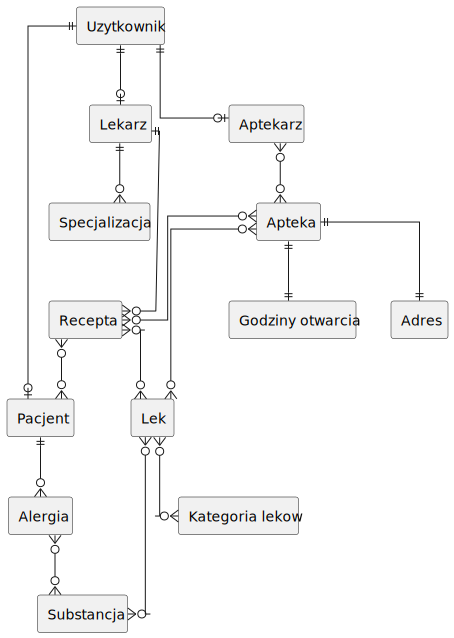

# Faza konceptualna
Projekt systemu e-recepty opiera się na potrzebach informacyjnych pacjentów, lekarzy oraz aptek. System ten ma na celu usprawnienie i zautomatyzowanie procesu przepisywania, realizacji i monitorowania recept na leki.
* [Streszcenie](#streszczenie)
* [Cele projektu](#cele-smart)
* [Zakres projektu](#zakres)
* [Wymagania funkcjonalne](#wymagania-funkcjonalne)
* [Diagram obiektowo związkowy](#diagram-obiektowo-związkowy)
___
### Streszczenie 
Główne potrzeby informacyjne oraz czynności wyszukiwania, które można wykonać za pomocą projektowanej bazy danych:
1. Dane pacjenta:
- Wyszukiwanie informacji o pacjencie na podstawie jego numeru PESEL lub innych danych identyfikacyjnych.
- Dostęp do alergii, aktualnych recept oraz danych kontaktowych pacjenta.
2. Recepty:
- Przechowywanie recept w formie elektronicznej w bazie danych.
- Wyszukiwanie recept na podstawie numeru recepty, daty wystawienia, lekarza, rodzaju leku itp.
3. Lekarze:
- Zarządzanie danymi lekarzy, w tym informacjami kontaktowymi i specjalizacją.
- Wyszukiwanie lekarzy w celu kontaktu.
4. Apteki:
- Baza danych aptek, zawierająca informacje o lokalizacji, godzinach otwarcia i dostępności leków.
- Wyszukiwanie aptek na podstawie potrzebnych leków lub o konkretnych godzinach otwarcia.
5. Aptekarze:
- Zarządzanie danymi aptekarzy, w tym informacjami kontaktowymi i miejscem pracy.
- Wyszukiwanie aptekarzy w celu kontaktu.
6. Leki:
- Katalog leków, zawierający informacje o ich składzie, dawkowaniu i działaniach niepożądanych.
- Wyszukiwanie leków na podstawie nazwy, substancji czynnej lub kategorii terapeutycznej.
7. Statystyki i raporty:
- Generowanie raportów statystycznych dotyczących przepisanych leków, ilości wystawionych recept i kosztów leków.
- Analiza danych w celu monitorowania tendencji w dziedzinie farmacji i medycyny.
___
### Cele smart
#### 1. Specific:
Celem projektu jest stworzenie prototypu systemu e-recepty, który będzie demonstracją działania rozwiązania. Skupiamy się na podstawowych funkcjonalnościach, takich jak wyszukiwanie i wystawianie recept oraz przechowywanie danych leków, aptek, lekarzy, i t.p.
#### 2. Measurable:
Sukces projektu będzie mierzalny poprzez ocenę wzrostu efektywności w procesie przepisywania, realizacji i monitorowania recept na leki. Możemy także zmierzyć liczbę korzystających z systemu użytkowników oraz generowanych raportów wraz z ich analizą.
#### 3. Achieable
Uwzględniając dostępny czas oraz ilość członków jesteśmy w stanie stworzyć działającą bazę danych dla systemu e-recepty bez platformy do jej obsługi.
#### 4. Realistic 
Projekt jest realistyczny, ponieważ opiera się na istniejących technologiach informatycznych i potrzebach społeczności medycznej. Podobne systemy są już w użyciu, co świadczy o ich wykonalności.
#### 5. Time-bound
Projekt ma być zakończony w ciągu 6 miesięcy od rozpoczęcia. Podział czasu obejmuje etapy projektowania, tworzenia podstawowej wersji, przeprowadzanie testów i zbieranie opinii.
___
### Zakres
#### Należy uwzględnić:
- Stworzenie relacyjnej bazy danych do przechowywania informacji o pacjentach, lekach, receptach, lekarzach itp.
- Zapewnienie mechanizmu logowania użytkowników z różnymi poziomami dostępu.
- Mechanizm przypisywania leków przez lekarzy.
#### Nie należy uwzględniać:
- Implementacji aplikacji
- Projektowania interfejsów graficznych
___
### Wymagania funkcjonalne
#### 1. Pacjent
* Logowanie do systemu
* Wyświetlanie przypisanych recept
* Wyświetlanie informacji o recepcie
#### 2. Lekarz
* Logowanie do systemu
* Wystawianie recept dla wybranego pacjenta
* Wyszukiwanie pacjentów
* Wyszukiwanie leków
#### 3. Aptekarz
* Logowanie do systemu
* Wyszukiwanie leków
* Realizacja recept
* Zarządzanie magazynem leków
#### 4. Administrator
* Logowanie do systemu
* Zarządzanie kontami użytkowników
* Zarządzanie bazą danych
___
### Diagram obiektowo-związkowy
