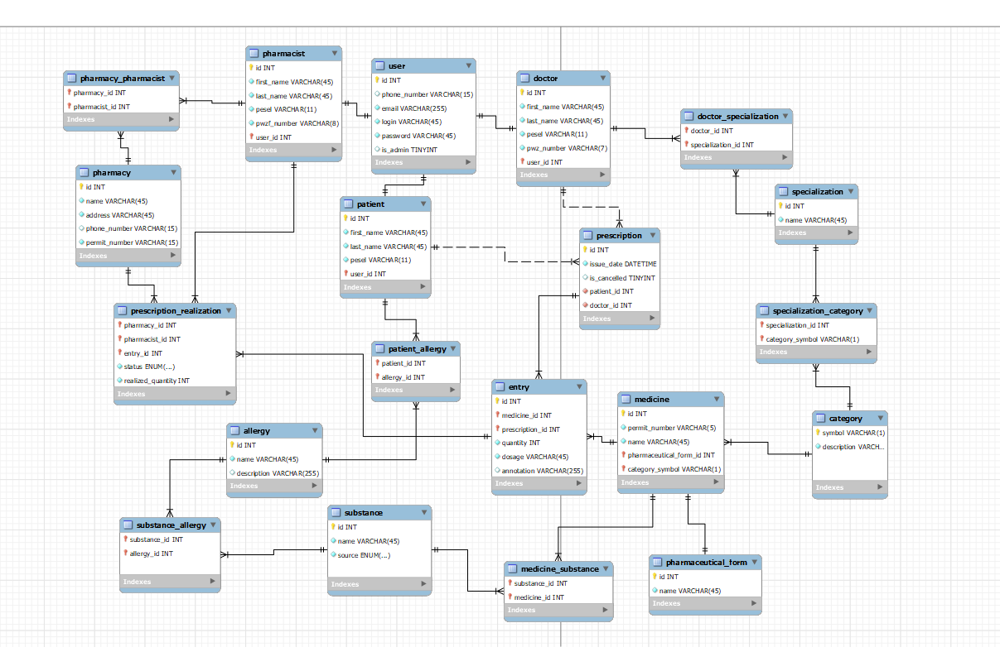

# Faza logiczna

Projekt systemu e-recepty.

___

## Definicja schematów relacji

1. Schemat relacji ***Użytkownik***

Atrybuty:
- id (klucz główny)
- telefon
- email
- login
- haslo
- czy_admin

Zależności:
- Brak zależności funkcyjnych i wielowartościowych.

2. Schemat relacji ***Pacjent***

Atrybuty:
-	id (klucz główny)
-	imię
-	nazwisko
-	pesel
-	uzytkownik_id

Zależności:
-  uzytkownik_id -> Uzytkownik.id (zależność funkcyjna)

3. Schemat relacji ***Farmaceuta***

Atrybuty:
-	id (klucz główny)
-	imię
-	nazwisko
-	pesel
-	numer_pwzf
-	uzytkownik_id

Zależności:
-  uzytkownik_id -> uzytkownik.id (zależność funkcyjna)

4. Schemat relacji ***Lekarz***

Atrybuty:
-	id (klucz główny)
-	imię
-	nazwisko
-	pesel
-	numer_pwz
-	uzytkownik_id

Zależności:
-  uzytkownik_id -> Uzytkownik.id (zależność funkcyjna)

5. Schemat relacji ***Postać farmaceutyczna***

Atrybuty:
-	id (klucz główny)
-	nazwa

Zależności:
-   Brak zależności funkcyjnych i wielowartościowych

6. Schemat relacji ***Substancja***

Atrybuty:
-	id (klucz główny)
-	nazwa
-	źródło

Zależności:
-   Brak zależności funkcyjnych i wielowartościowych

7. Schemat relacji ***Lek***

Atrybuty:
-	id (klucz główny)
-	numer_pozwolenia
-   nazwa
-	dawkowanie
-   postac_farmaceutyczna_id

Zależności:
-   postac_farmaceutyczna_id->postac_farmaceutyczna.id (zależność funkcyjna)

8. Schemat relacji ***Kategoria leków***

Atrybuty:
-	symbol (klucz główny)
-	opis

Zależności:
-   Kategorie leków dotyczą wielu leków (zależność wielofunkcyjna)
-   Kategorie leków może wystawiać wielu lekarzy (zależność wielofunkcyjna)

9. Schemat relacji ***Specjalizacja***

Atrybuty:
-	id (klucz główny)
-	nazwa

Zależności:
-   Specjalizacja dotyczą wielu lekarzy (zależność wielofunkcyjna)
-   Specjalizacja ma uprawnienia do wielu kategorii leków (zależność wielofunkcyjna)

10. Schemat relacji ***Alergia***

Atrybuty:
-	id (klucz główny)
-	nazwa
-   opis

Zależności:
-   Alergia dotyczą wielu pacjentów (zależność wielofunkcyjna)
-   Alergia dotyczy wielu substancji (zależność wielofunkcyjna)

11. Schemat relacji ***Apteka***

Atrybuty:
-	id (klucz główny)
-	nazwa
-   adres
-   numer_telefonu
-   numer_zezwolenia

Zależności:
-   Brak zależności funkcyjnych.

12. Schemat relacji ***Recepta***

Atrybuty:
-	id (klucz główny)
-	data_wystawienia
-   czy_anulowano
-   pacjent_id
-   lekarz_id

Zależności:
-   pacjent_id -> pacjent.id (zależność funkcyjna)
-   lekarz_id -> lekarz.id (zależność funkcyjna)

13. Schemat relacji ***Wpis***

Atrybuty:
-	id (klucz główny)
-	lek_id
-   recepta_id
-   ilosc
-   adnotacja

Zależności:
-   lek_id -> lek.id (zależność funkcyjna)
-   recepta_id -> recepta.id (zależność funkcyjna)

14. Schemat relacji ***Realizacja recepty***

Atrybuty:
-	id (klucz główny)
-	apteka_id
-   wpis_id
-   status
-   realizowana_ilosc

Zależności:
-   apteka_id -> apteka.id (zależność funkcyjna)
-   wpis_id -> wpis.id (zależność funkcyjna)
___

## Diagram relacji

